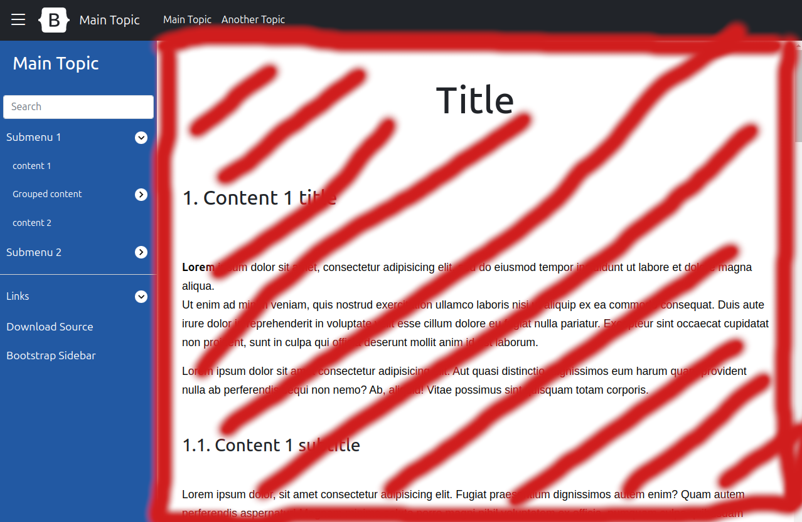

# Modo de uso

## Índice

- [Modo de uso](#modo-de-uso)
  - [Índice](#índice)
  - [Esquema básico de la página](#esquema-básico-de-la-página)
  - [Estructura de carpetas](#estructura-de-carpetas)
    - [Estructura de carpetas de una `vista`. Ejemplo: "Main view"](#estructura-de-carpetas-de-una-vista-ejemplo-main-view)
  - [Cómo crear una vista](#cómo-crear-una-vista)
  - [Cómo crear un contenido (componente)](#cómo-crear-un-contenido-componente)
  - [Añadir un enlace del componente recién creado al sidebar](#añadir-un-enlace-del-componente-recién-creado-al-sidebar)


## Esquema básico de la página

La página se compone de los siguientes elementos:

- `Navbar`: barra superior de navegación, al pulsar los enlaces se podrá cambiar de `vista`

- `Sidebar`: barra lateral de navegación, al pulsar los enlaces se podrá cambiar de `contenido`

- `Contenido`: html que se renderiza en la parte principal de la página. En esta sección se pondrá lainformación de lo que se quiera explicar, imágenes etc. En cada `contenido` se tratará un tema concreto. A nivel técnico los distintos contenidos seran componentes creados con WebComponents de javascript.

- `Vista`: Engloba el `sidebar` y el `contenido`, cada vista tendrá un sidebar diferente y varios contenidos accesibles desde el sidebar. En cada vista se tratará un tema genérico.

- `Icono de la vista`: Icono que aparecerá en la `navbar`y que irá cambiando con cada vista.


## Estructura de carpetas


Todo el contenido de la página irá dentro de la carpeta components. 

- Dentro de esta carpeta está la carpeta common, necesaria para el correcto funcionamiento de la página. 
  
- Dentro de la carpeta common, el único archivo que hay que modificar es el archivo `components/common/assets/constants.json`

- Por otra parte, al mismo nivel que la carpeta common, se encuentran las carpetas que representarán el contenido de cada uno de los enlaces que aparecen en el `navbar` y al que llamaremos `vistas`

>[!NOTE]
> - En este ejemplo se pueden ver dos enlaces en el `navbar`: Main Topic y Another Topic.  
> - Cada uno de estos enlaces llevará a una `vista`, que son la main-view y la another-view respectivamente.  
>  - Las carpetas dentro de las cuales se guardará todo lo relacionado con estas vistas se pueden ver en la imagen anterior.


- Por último, dentro de cada carpeta de `vista`, se encontrarán las siguientes carpetas:
  
  1. common: Dentro de esta carpeta se encontrarán el icono de la vista y el json que definirá los enlaces que aparecen en el `sidebar` y que llevarán a cada uno de los `contenidos`
  
  2. varias carpetas de `contenido`, dentro de las cuales se encontrarán las imágenes utilizadas en dicho contenido, el html del contenido y el js que se encargará de crear el `componente`  
   

### Estructura de carpetas de una `vista`. Ejemplo: "Main view"


> [!Note]
> - El logo de esa `vista` debe estar dentro de la carpeta `<ruta_a_la_vista>/common/assets/img/logo.svg`
> - El json que define qué enlaces se verán en el `sidebar` debe encontrarse en la ruta `<ruta_a_la_vista>/common/assets/sidebar.json`

- Esta `vista` tendrá varios `contenidos` accesibles desde el `sidebar`. 
  
- En este ejemplo, estos `contenidos` están definidos dentro de las carpetas content-1, content-2, content-3 y content-4
  
- Dentro de estas carpetas se encontrarán el `componente` (compuestos por un html y un js) y una carpeta assets, donde se guardarán las imágenes y otros archivos externos que se usarán dentro de este componente

>[!NOTE]
>Al cargar una vista se cargará el primer `contenido` que esté definido en el sidebar, en este caso el content-1.


## Cómo crear una vista


## Cómo crear un contenido (componente)

1. En primer lugar se deberá crear una carpeta de `vista` donde se guardarán varios `contenidos` que tengan que ver con el mismo tema.  

    >[!NOTE]
    > Por ejemplo, si vamos a hablar de bootstrap y vamos a hacer un `contenido` que habla sobe el origen de bootstrap y otro `contenido` que habla sobre como usar bootstrap, dentro de la carpeta components se creará una carpeta llamada bootstrap dentro de la cual se creará una carpeta common y a parte una carpeta por cada `contenido`.
    >  
    > 

2. En segundo lugar, dentro de la carpeta del `contenido`, hay que crear un html y un js
    
    

    1. HTML: En este archivo se escribirá el html que se quiera que renderizará en la siguiente zona de la pantalla
   
        

    2. JS: En este archivo se creará el webcomponent a nivel de javascript y se establecerá cual será el nombre de etiqueta del componente

     >[!TIP]
    > - Se debe copiar siempre este código y sustituir el valor de `tagName` por el nombre de etiqueta que se le quiera dar al webcomponent (nombre inventado pero que empiece por la palabra component) y se debe sustituir el valor de `htmlFileName` por el nombre del html que corresponda a dicho componente.  
    > - También cambiará la ruta relativa del import del component-generator dependiendo de donde estemos creando el nuevo componente

    ```javascript
    import { createComponent } from "../../../js/component-generator.js";

    const tagName = 'component-bootstrap-origin';
    const htmlFilename = 'origen.html';

    const baseUrl = import.meta.url.substring(0, import.meta.url.lastIndexOf('/') + 1);
    createComponentent(tagName, baseUrl + htmlFilename);
    ```

    3. Añadir el nuevo componente creado al archivo components-imports.js

        Una vez creado el nuevo WebComponent debe importarse el js que define ese WebComponent mediante una ruta relativa en el archivo `/js/components/imports.js`

        ```javascript
        //Nuevo componente origen de bootstrap
        import '../components/bootstrap/origen/origen.js';
        ```
        
## Añadir un enlace del componente recién creado al sidebar
    


